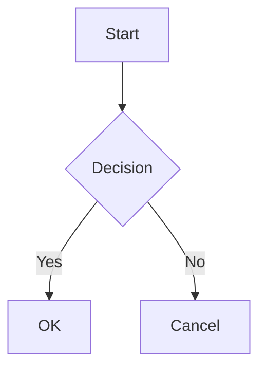
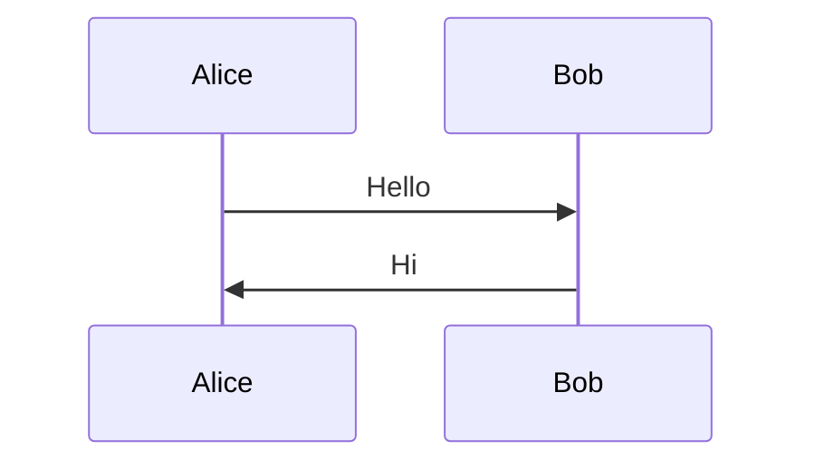

# その他拡張

## Mermaid

Mermaidを使って、図表を作成できます。

### フローチャート

````

```mermaid
graph TD
    A[Start] --> B{Decision}
    B -->|Yes| C[OK]
    B -->|No| D[Cancel]
```
````


```mermaid
graph TD
    A[Start] --> B{Decision}
    B -->|Yes| C[OK]
    B -->|No| D[Cancel]
```

### シーケンス図

````

```mermaid
sequenceDiagram
    Alice->>Bob: Hello
    Bob->>Alice: Hi
```
````


```mermaid
sequenceDiagram
    Alice->>Bob: Hello
    Bob->>Alice: Hi
```

詳細: [Mermaid公式ドキュメント](https://mermaid.js.org/)
